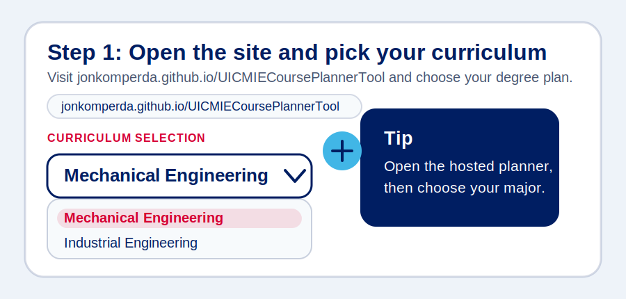
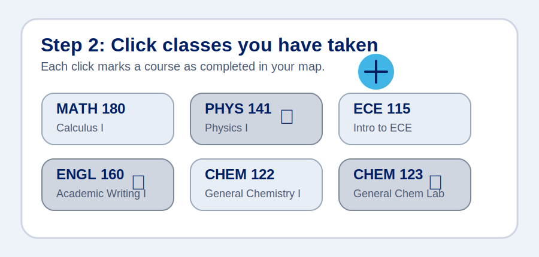
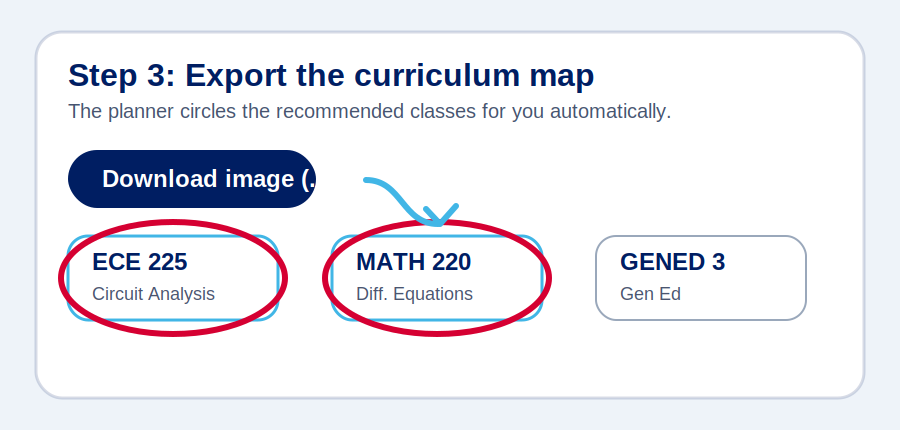

# MIE Course Planner Tool

1. Go to [jonkomperda.github.io/UICMIECoursePlannerTool](https://jonkomperda.github.io/UICMIECoursePlannerTool/) and pick your curriculum.

2. Click the boxes for the classes you have already taken.

3. Export the curriculum map as an image.

The planner automatically circles the classes it recommends you should take next.

## License

This project uses the [CC BY-NC-SA 4.0](LICENSE) license. Please give attribution, do not use it commercially, and keep the same license on shared adaptations.
